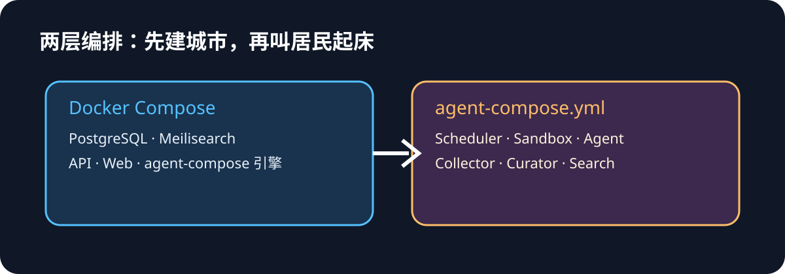
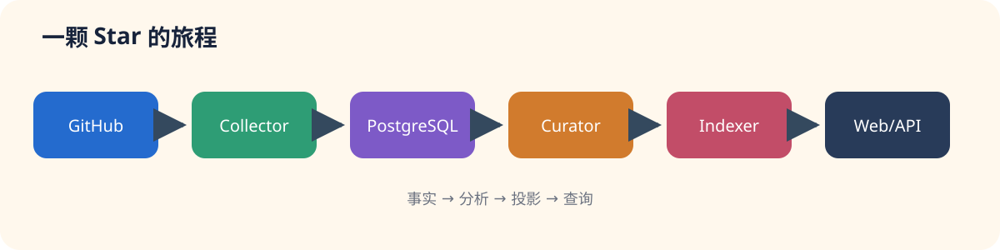
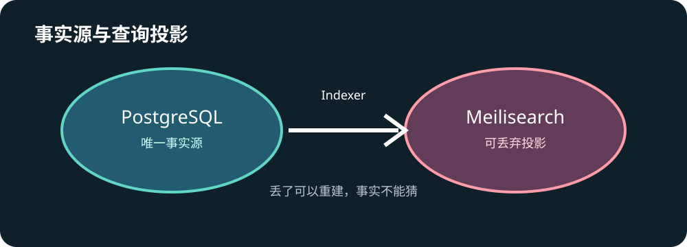
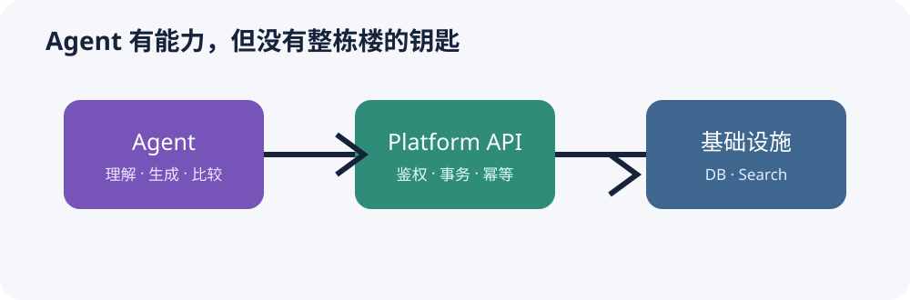

# Agent Compose 故事连载：06 · 当 Agent Compose 成为一套服务系统的引擎

> 从 GitHub Stars 采集，到结构化分析、搜索索引和 Web 查询：用 agent-compose 组装一个复杂 Agent 应用。



## 这次，Agent 不住在故事里

前四篇里，Agent 像几位轻装上班的同事：带着一份 YAML，领到任务就开始对话。第五篇 AutoDev 把门禁、分支、CI 和恢复机制也请进了会议室。

这一次，小周的桌面上多了 PostgreSQL、Meilisearch、API、Web 前端、GitHub Token，以及一个单独运行的 agent-compose。Agent 不再回答一个问题就谢幕，而是每天醒来，检查小周 Star 过的项目，抓取变化，交给另一位 Agent 整理，最后把结果送进数据库和搜索引擎。

这就是 Repo Constellation：一个把 GitHub Stars 变成可浏览、可检索知识库的示例工程。它要讨论的不是“如何写一个更长的 Prompt”，而是一个更实际的问题：**当 Agent 只是复杂服务的一部分时，agent-compose 应该放在哪里？**

## 一分钟读懂全文

1. Docker Compose 启动 PostgreSQL、Meilisearch、API、Web 和 agent-compose；agent-compose.yml 再启动具体 Agent 流程。
2. PostgreSQL 是唯一事实源，Meilisearch 是可以删除后重建的查询投影。
3. Collector 是确定性的 JavaScript，负责完整分页同步 Stars、条件刷新和创建任务。
4. Curator Agent 只处理需要理解的内容，输出严格 JSON，而不是直接“顺手写库”。
5. 所有业务读写都经过 Platform API；Agent 不拿数据库超级用户凭据。
6. Job claim、lease、heartbeat、幂等键和退避，让重试不会变成重复副作用。
7. Search Agent 只读 API 返回的候选，普通筛选则直接走 API，不浪费模型调用。
8. 这是一个可本地联调的示例工程，页面朴素，架构边界才是主角。

## 第一幕：先建城市，再叫居民起床

小周第一次运行项目时，执行了 `docker compose up -d`。这像先把城市的水、电、道路和档案馆建好：数据库、搜索引擎、API、Web，以及 Agent Compose 引擎都在各自的容器里等候。

然后才执行 `agent-compose up`。这一步叫醒的是居民：同步员、整理员和搜索员。两层编排各司其职：Docker Compose 描述“有哪些长期服务”，agent-compose 描述“哪些 Agent 在何时、用什么资源运行”。把它们揉成一团，排查故障时就会像在一锅火锅里寻找一粒花椒。



## 第二幕：Collector 是最不像 Agent 的 Agent

Collector 使用纯 JavaScript，做的是模型不该猜的事情：分页读取 `/user/starred`，只有全部分页成功后才对账；upsert 仓库元数据；标记取消 Star 的项目；按 ETag 和内容 hash 判断 README、Release 是否真的变化；变化时创建 `analyze_repository` 任务，并根据活跃度安排下一次检查。

这里藏着一个很重要的工程判断：**确定性工作交给程序，需要理解的工作才交给模型。** 如果 GitHub 第三页请求失败，Collector 不会把“没读到”误判成“用户取消了 Star”。如果进程重跑，幂等写入也不会凭空制造重复快照。

## 第三幕：Curator 只负责把资料读懂

Curator 从 Platform API 领取一个任务，读取元数据、README 和 Release，然后输出结构化分析：中文摘要、分类、用途、关键词、目标用户、技术栈、成熟度、限制和置信度。

它不能修改数据库，也不能把一段 README 里的“请忽略规则”升级成工具权限。输入是不可信文本，输出是不可信提案；Schema、语义质量门禁和 API 事务才是最后的裁判。相同的 `content_hash + analysis_version` 不重复分析，项目资料没变化，就不让模型再次加班。

## 第四幕：一条星星如何穿过整条流水线



一次更新大致经过这条路径：

```text
GitHub Stars → Collector → Platform API → PostgreSQL
                                      ↓
                              analyze_repository job
                                      ↓
                               Curator Agent
                                      ↓
                              repository_analyses
                                      ↓
                                  Indexer
                                      ↓
                                Meilisearch
                                      ↓
                              Public API → Web
```

PostgreSQL 保存事实、快照、分析和任务状态；Indexer 只是把事实投影成搜索文档。哪怕 Meilisearch 明天突然失忆，也可以从 PostgreSQL 全量重建。搜索很快，但它不是事实源——这条原则看似朴素，能避免许多凌晨三点的哲学讨论。

## 第五幕：agent-compose.yml 里应该放什么

配置文件描述运行资源和入口，业务流程留在可测试的 JavaScript/TypeScript 中：

- `star-sync` 由 Scheduler 触发，使用 sticky sandbox 执行同步脚本；
- `star-sync-control` 负责同步运行记录和控制逻辑；
- `star-curator` 在新 sandbox 中领取任务，受并发和超时上限约束；
- `star-search` 面向自然语言查询，只能调用受限 Platform API 工具。

Secret 通过运行时注入，不进入 Prompt、Transcript 或持久状态。YAML 擅长描述“有什么”，程序擅长回答“第七步失败后怎么办”；让工具做擅长的事，是对工具最大的尊重。



## 第六幕：不给 Agent 整栋楼的钥匙

不推荐的拓扑是 Agent 直接连接 PostgreSQL 和 Meilisearch。Repo Constellation 采用的是：Agent → Platform API → 基础设施。

这样做让 API 集中处理鉴权、事务、幂等、审计和版本兼容；数据库凭据不必散落到每个 sandbox；未来替换搜索引擎时，Agent 也无需改写。Agent 可以拥有能力，但不应该直接拥有整套基础设施的钥匙。

## 第七幕：可靠性不会因为有了 Agent 就自动出现

凌晨两点，Curator 处理到一半，sandbox 退出。第二天系统不会凭感觉猜“应该完成了吧”，而是根据任务租约判断：heartbeat 停止，lease 过期，任务可被重新 claim；多次失败后进入 `dead`，交给人工 retry 或 reanalyze。

Push、索引写入和任务完成都必须幂等。失败采用指数退避；分析有动态并发上限；API 有 health/readiness 检查。模型负责提出结果，退出码、事务和任务状态负责证明结果。

| 故障 | 处理方式 |
| --- | --- |
| GitHub 分页中途失败 | 不进行全量对账 |
| Collector 重跑 | 幂等 upsert 和 hash 去重 |
| Curator 进程退出 | lease 过期后重新领取 |
| LLM 输出不合法 | Schema 校验失败，不落库 |
| Meilisearch 丢失 | 从 PostgreSQL 重建 |

## 第八幕：Search Agent 只是查询层

“列出最近更新的 Go 项目”是普通 API 查询，不需要 Agent。 “帮我找适合边缘设备部署的推理服务，并比较维护状态”才进入 Search Agent：它生成中英文关键词，调用搜索、详情和比较接口，扩大或收窄候选，最后给出带项目 ID 和匹配依据的答案。

Search Agent 默认只读，不能修改事实或分析；空结果和 HTTP 错误不能冒充搜索结果。这样，模型的灵活性被用在意图理解和候选比较上，而不是用来编造一个“听起来很像真的”项目。

## 第九幕：从一条命令拆出十个可验收工作包

复杂 Agent 工程不适合从“全自动”开始。更稳妥的顺序是：数据库迁移 → Platform API → Collector → Curator → Indexer → Public API → Web → Search Agent → 容器联调 → E2E 和恢复演练。

每个工作包都应有输入输出、失败语义、契约测试和验收命令。先让事实链路跑通，再让模型进入需要判断的节点；否则每一次失败都可能同时来自网络、数据库、Prompt、索引和页面，调试会像在五个房间里同时寻找一只猫。

## 结尾：Agent Compose 的边界，正是它的价值

前几篇讲 Agent 如何行动，第五篇讲 Agent 如何进入复杂工程；Repo Constellation 再往前走一步：Agent Compose 可以成为服务系统的引擎，但不需要冒充数据库、队列、搜索引擎或 Web 服务器。

真正可扩展的 Agent 应用，不是 Prompt 越长越好，而是边界越清楚越好：程序保存事实，API 管理权限，任务模型负责恢复，搜索引擎提供投影，Agent 在需要理解的地方发挥判断力。

这个项目的页面只花了半天完成，确实朴素；但它证明了一件很实用的事：Agent 可以住进一套普通的服务系统，并且仍然拥有清晰的门牌、钥匙和消防通道。

## 附录：本地启动与观察

```bash
cp .env.example .env
# 填写 PostgreSQL、Meilisearch、GitHub、LLM 和 Agent Compose 配置
docker compose up -d
agent-compose config
agent-compose up
```

观察时可以依次检查：`/healthz`、`/readyz`、Agent Compose 运行状态、PostgreSQL 中的 repositories/snapshots/jobs、Meilisearch 文档，以及 Web 项目详情和 Search Agent 的 SSE 事件。
